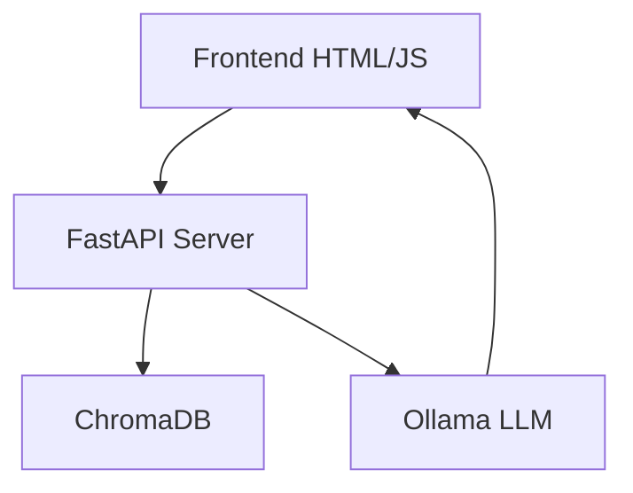
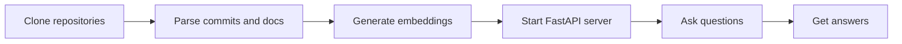

# Odoo Migration RAG Assistant

This project builds a full Retrieval Augmented Generation (RAG) system to assist with Odoo migrations, entirely local, using:

- FastAPI
- ChromaDB
- Ollama (running CodeLlama or any other local model)
- HTML/JS frontend

## Installation

- Install Python 3.11 and pip
- Install Ollama: https://ollama.com
- Install requirements:

```bash
pip install fastapi uvicorn chromadb requests tqdm
```

## Setup

Clone the repos and parse data:

```bash
python scripts/commit_parser.py
python scripts/parse_odoo_doc.py
python scripts/generate_embeddings.py
```

Start Ollama model:

```bash
ollama run codellama
```

Run the API server:

```bash
python app.py
```

Access at [http://localhost:8000](http://localhost:8000)

## Architecture



## Flow



## Notes

- Ollama must be running locally at port 11434
- Default model: `codellama:latest`
- You can easily adapt it to any project with code or documentation
